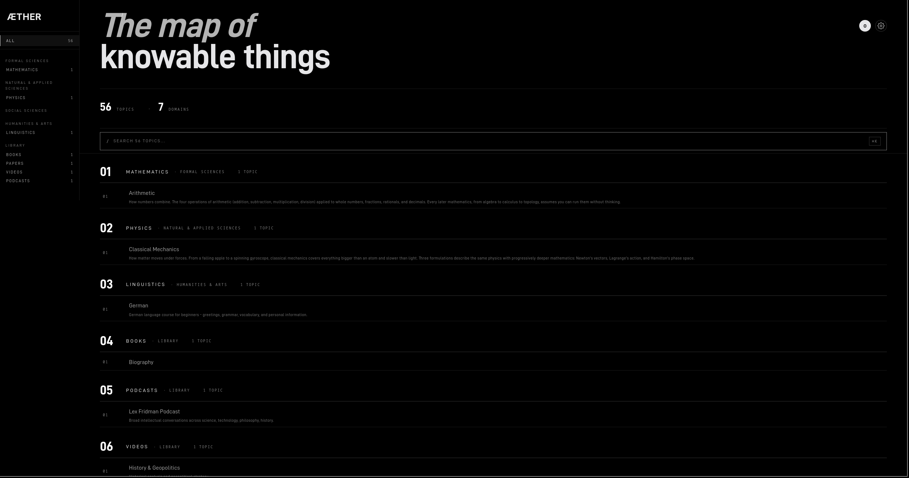
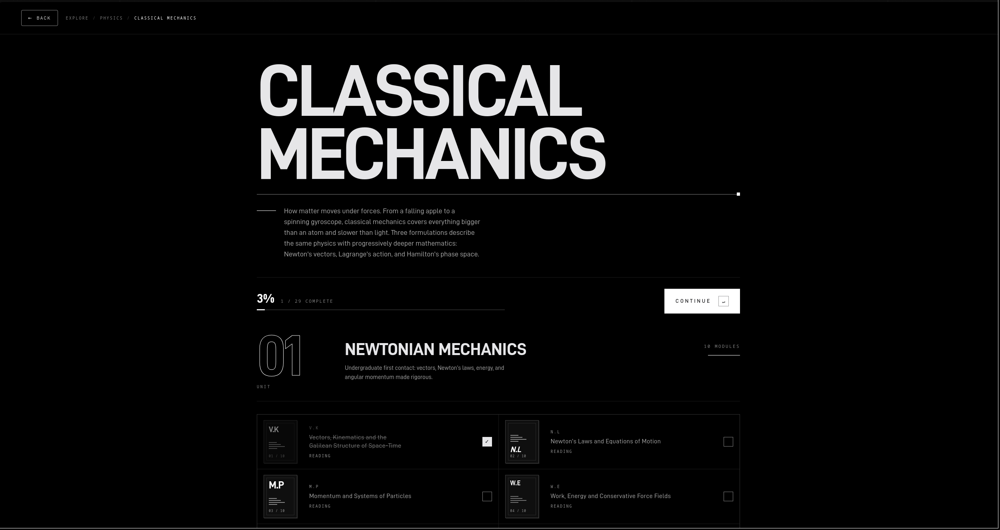
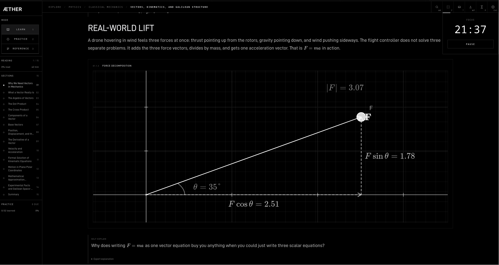

<p align="center">
  
</p>

<p align="center">
  <a href="LICENSE"></a>
  <a href="LICENSE"></a>
  <a href="https://github.com/sponsors/StilyanX"></a>
</p>

<p align="center"><strong>No streaks. No points. No accounts. Just knowledge.</strong></p>

<p align="center">A free, self-hosted learning platform. Every subject, in plain language, full depth.<br>Community-built. Forever free.</p>

---

<p align="center">
  
</p>
<p align="center">
  
</p>
<p align="center">
  
</p>

---

## Why Aether

Most learning platforms are built around keeping you on the platform. Aether is built around getting knowledge into your head.

- **No gamification.** No streaks, badges, leaderboards, or daily limits.
- **No accounts.** Nothing is sent to any server. Progress lives in your browser.
- **No paywalls.** Every topic, every tool, every flashcard. Free.
- **No bloat.** Installs in one command. Runs offline. No backend required.
- **Serious tools.** FSRS spaced repetition. LaTeX equations. Interactive visualizations. Physics simulations.

---

## What's Inside

<table align="center">
  <tr>
    <td><strong>LEARN</strong></td>
    <td><strong>PRACTICE</strong></td>
    <td><strong>REFERENCE</strong></td>
  </tr>
  <tr>
    <td>Long-form articles. LaTeX equations. Interactive geometry. Code blocks. Progressive disclosure.</td>
    <td>FSRS-powered spaced repetition. Predict-and-explain cards. Locally computed intervals. Session stats.</td>
    <td>Formula sheets. Key definitions. One page per topic.</td>
  </tr>
</table>

**Subjects currently covered:**

- **Mathematics:** Arithmetic (place value, fractions, decimals, number theory, rational numbers) with interactive tools
- **Physics:** Classical Mechanics (Newtonian, Lagrangian, Hamiltonian, perturbation theory)
- **Languages:** German A1
- **Explore:** curated books, papers, podcasts, videos

More subjects ship continuously.

---

## Support the Project

Aether will always be free. If it's useful, consider sponsoring. It funds new content, new subjects, and keeps the lights on.

<p align="center">
  <a href="https://github.com/sponsors/StilyanX">
    
  </a>
</p>

---

## Installation

**Linux / macOS**

```bash
curl -fsSL https://raw.githubusercontent.com/StilyanX/aether/main/install.sh | bash
```

**Windows** (PowerShell, run as Administrator)

```powershell
irm https://raw.githubusercontent.com/StilyanX/aether/main/install.ps1 | iex
```

Open [http://localhost:8000](http://localhost:8000). Aether loads automatically.

<details>
<summary>Manual install</summary>
<br>

Install [Node.js LTS](https://nodejs.org) and [Git](https://git-scm.com), then:

```bash
git clone https://github.com/StilyanX/aether.git
cd aether
npm install
npm run dev
```

</details>

<details>
<summary>Troubleshooting</summary>
<br>

| Symptom                             | Fix                                                                                    |
| ----------------------------------- | -------------------------------------------------------------------------------------- |
| `curl: command not found` (Windows) | Use the PowerShell command instead                                                     |
| `winget: command not found`         | Update Windows to 1709+ or install Node manually from [nodejs.org](https://nodejs.org) |
| Port 8000 already in use            | Open [http://localhost:8000](http://localhost:8000) directly                           |
| Blank page or 404                   | Navigate to [http://localhost:8000/Aether/](http://localhost:8000/Aether/) manually    |

</details>

---

## Ways to Contribute

Aether is built by one person so far. The point of it being open source is that it should not stay that way.

There is no fixed list of what you can contribute. If you know something, write it. If something is broken, fix it. If something could be clearer, improve it. If a subject is missing, add it. If a visualization would make something click, build it.

A few examples to get started:

- **Content:** topic articles, flashcard decks, reference sheets, worked examples
- **Visualizations:** interactive diagrams, physics simulations, geometry tools
- **Code:** bug fixes, performance, accessibility, packaging, new features
- **Review:** fact-check a chapter, improve an explanation, catch an error

See CONTRIBUTING.md for dev setup. See WANTED.md for concrete asks.

### The Wanted List

`WANTED.md` is a flat list of concrete asks. Comment on the corresponding issue to claim one. If what you want to add is not on the list, open an issue first.

### What This Project Will Not Become

A few choices are not up for change. Contributions that move against them will be declined:

- No accounts.
- No backend.
- No streaks, XP, badges, daily goals, notifications, or engagement metrics.
- No paywall, subscriptions, premium tier, or telemetry.

Everything else is open. To argue with one of the above, open an issue with `track:design-principles`.

---

### Stack

<p>
  
  
  
  
  
  
</p>

### Privacy

No accounts. No backend. No cookies. All progress stored locally in `localStorage` and `IndexedDB`. Nothing is sent to any external server.

### Standards

WCAG 2.2 accessible. ARIA labels on interactive elements. 2px focus indicators. `prefers-reduced-motion` support. Sub-second first paint.

### License

Platform code (`src/`, `public/`, config files): [MIT](LICENSE).
Learning content (`src/features/`): [CC BY-NC-SA 4.0](LICENSE).

<details>
<summary>Attribution</summary>
<br>

Content is derived from university-level textbooks and educational materials. All source material is credited on each topic page. Content is rewritten in plain language, restructured for active recall, and supplemented with worked examples and visual explanations. No verbatim text is reproduced.

This use constitutes fair use under 17 U.S.C. 107: educational, non-commercial, transformative, no market substitution.

Sources include works by Kleppner & Kolenkow and others.

</details>
